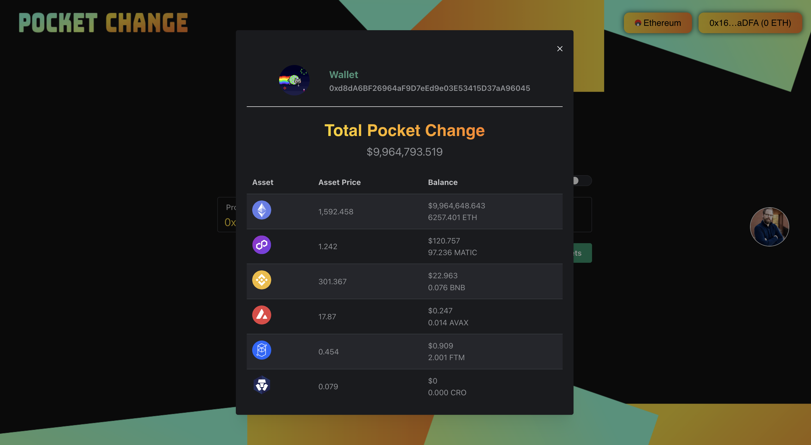

<html>
<body>
<link rel="stylesheet" href="https://cdnjs.cloudflare.com/ajax/libs/font-awesome/6.3.0/css/all.min.css" integrity="sha512-SzlrxWUlpfuzQ+pcUCosxcglQRNAq/DZjVsC0lE40xsADsfeQoEypE+enwcOiGjk/bSuGGKHEyjSoQ1zVisanQ==" crossorigin="anonymous" referrerpolicy="no-referrer" />

# Pocket Change

  

  <table style="width:100%">
    <thead>
      <tr>
        <th>Language</th>
        <th>Built With</th>
        <th>Styled With</th>
        <th>Blockchain Data</th>
      </tr>
    </thead>
    <tbody>
      <tr>
        <td><a href="https://www.typescriptlang.org/">Typescript</a></td>
        <td><a href="https://nextjs.org/">Next.js</a></td>
        <td><a href="https://mantine.dev/">Mantine</a></td>
        <td><a href="https://admin.moralis.io/">Moralis</a></td>
      </tr>
    </tbody>
  </table>

<h2 style="color:orange">About The Project</h2>

  I got tired of not having a clean and easy way to review my wallet balances cross-chain. With a little help from Moralis, I was able to do just that effortlessly. 

<h2 style="color:orange">What I learned</h2>

  At this point I am fairly new to Moralis. I must say that they made it really easy to get up and running with their web3 api. This is my second project using Mantine. Take a look at my <a href="https://github.com/passandscore/find-my-nft" target="_blank">Find My NFT</a> project to see how I used it there. I have been using Next.js for a while now and I am still amazed at how easy it is to get up and running with a new project. Typescript is a must for me. I love the type safety that it provides.

<h2 style="color:orange">Installation</h2>

  <strong>You will be up and running in 3 simple steps</strong>

<pre>
Step 1
git clone https://github.com/passandscore/pocket-change

Step 2
yarn run dev

Step 3
Open your browser and go to http://localhost:3000/
</pre>

<h2 style="color:orange">Enviroment Variables</h2>

<pre>
Create a .env file on the root of the project and add the following

NEXT_PUBLIC_MORALIS_API_KEY="<'YOUR_V1_KEY_HERE'>"

</pre>

<h1 style="color:orange">Features</h1>

<strong>1. Search</strong>

<h4>Functionality</h4>

<ul style="margin-bottom:2rem">
  <li>Find a balance by connected wallet</li>
  <li>Find a balance by address</li>
</ul>

<strong>2. Summary</strong>

<h4>Functionality</h4>

<ul style="margin-bottom:2rem">
  <li>View current token price.</li>
  <li>View token balance in the native currency.</li>
  <li>View token balance in USD.</li>
</ul>

<strong>You can find me on social media:</strong>

</body>
</html>
